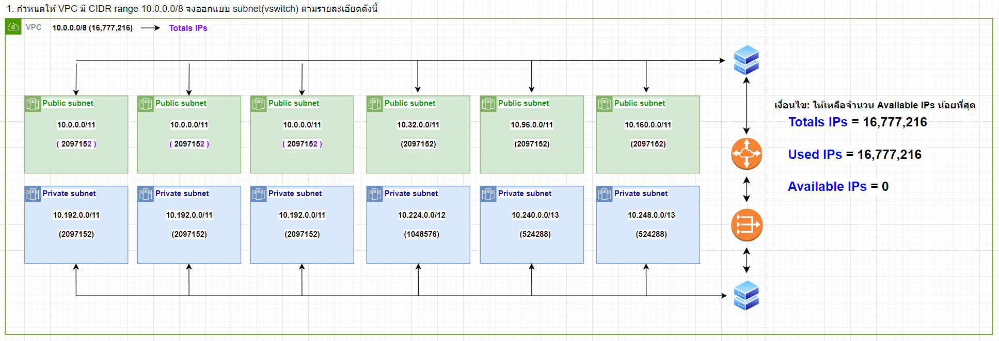
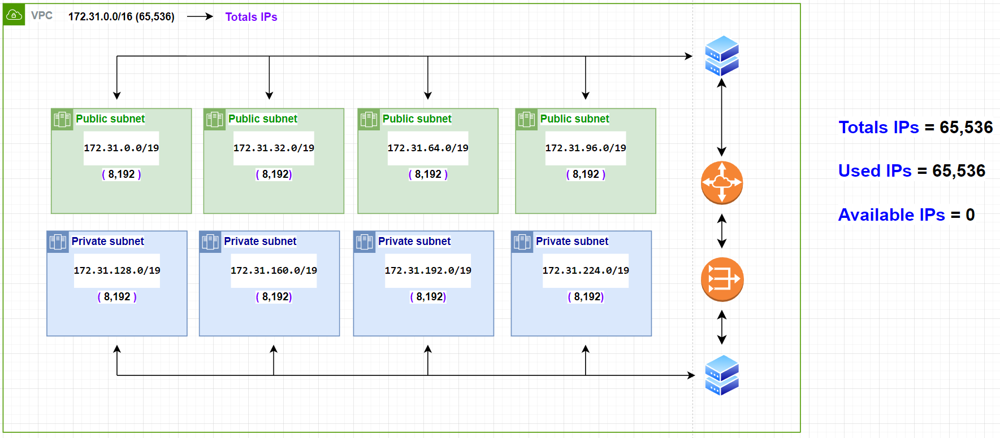

# 1.  กำหนดให้ VPC มี CIDR range 10.0.0.0/8 (16,777,216) จงออกแบบ subnet(vswitch) ตามรายละเอียดดังนี้
  
###   1.1 public 6 zone พร้อมระบุจำนวน ip ที่ใช้ได้
####    - ใช้ /12 ทั้งหมด 4 Zone Zone ละ 1,048,576 IP || รวม 4 zone = 1,048,576 * 4 = 4,194,304 IP
####    - ใช้ /11 ทั้งหมด 2 Zone Zone ละ 2,097,152 IP || รวม 2 zone = 2,097,152 * 2 = 4,194,304 IP
####    - ทั้งหมด 6 Zone รวม /12 4 Zone + /11 2 Zone = 4,194,304 + 4,194,304 = 8,388,608 IP
###    1.2 private: 6 zone พร้อมระบุจำนวน ip ที่ใช้ได้
####    - ใช้ /12 ทั้งหมด 4 Zone Zone ละ 1,048,576 IP || รวม 4 zone = 1,048,576 * 4 = 4,194,304 IP
####    - ใช้ /11 ทั้งหมด 2 Zone Zone ละ 2,097,152 IP || รวม 2 zone = 2,097,152 * 2 = 4,194,304 IP
####    - ทั้งหมด 6 Zone รวม /12 4 Zone + /11 2 Zone = 4,194,304 + 4,194,304 = 8,388,608 IP
###    1.3 ระบุจำนวน ip ที่ยังเหลือ
####    - เหลือ 16,777,216 - (8,388,608 * 2) = 0 IP

##   * เงื่อนไข: ให้เหลือจำนวน Available IPs น้อยที่สุด

# 2.  กำหนดให้ VPC มี CIDR range 172.31.0.0/16 (65,536) จงออกแบบ subnet(vswitch) ตามรายละเอียดดังนี้
  
###    2.1 public 4 zone พร้อมระบุจำนวน ip ที่ใช้ได้
####    - ใช้ได้ Zone ละ 8,192 IP || รวม 4 zone = 8,192 * 4 = 32,768 IP
###    2.2 private: 4 zone พร้อมระบุจำนวน ip ที่ใช้ได้
####    - ใช้ได้ Zone ละ 8,192 IP || รวม 4 zone = 8,192 * 4 = 32,768 IP
###    2.3 ระบุจำนวน ip ที่ยังเหลือ
####   - เหลือ 65,536 - (32,768 * 2) = 0 IP

##    * เงื่อนไข: ให้เหลือจำนวน Available IPs น้อยที่สุด

# 3.  จากคำตอบข้อ 1 และ 2 ให้ตอบคำถามย่อยต่อไปนี้
  
###    3.1 ต้องใช้ Service อะไรที่ทำให้ VPC จากข้อที่ 1 และ 2 สามารถรับส่งข้อมูลถึงกันได้
####    - ใช้ได้ Zone ละ 256 IP || รวม 4 zone = 256 * 4 = 1024 IP
###    3.2 จงวาดตาราง Route Table พร้อมระบุการ ค่าให้เรียบร้อย
####    - ใช้ได้ Zone ละ 256 IP || รวม 4 zone = 256 * 4 = 1024 IP

# 4.  (optional) ให้ออกแบบระบบซื้อขายของออนไลน์โดยมีองค์ประกอบดังนี้
  
###    4.1 สินค้า (product), ตะกร้าสินค้า(cart), จ่ายเงิน(payment), การขนส่งสิ่นค้า(Shipping), ผู้ใช้ (user)
####    - ใช้ได้ Zone ละ 256 IP || รวม 4 zone = 256 * 4 = 1024 IP
###    4.2 Database Service
####    - ใช้ได้ Zone ละ 256 IP || รวม 4 zone = 256 * 4 = 1024 IP
###    4.3 สามารถรองรับผู้ใช้งานได้จำนวนมหาศาล (แบบง่าย)
####    - ใช้ได้ Zone ละ 256 IP || รวม 4 zone = 256 * 4 = 1024 IP

# 5.  กำหนดให้ VPC A มี CIDR (10.0.0.0/16) และ VPC B  มี CIDR (10.0.0.0/20)จงตอบคำถามต่อไปนี้
  
###    5.1 VPC A และ VPC B สามารถ peering กันได้หรือไม่ หากไม่ได้จงบอกเหตุผล
####    - ใช้ได้ Zone ละ 256 IP || รวม 4 zone = 256 * 4 = 1024 IP
###    5.2 กรณีถ้า Peering ได้ จะต้องทำอย่างไร ให้ service ที่อยู่ภายใน VPC ทั้งสองสามารถติดต่อสื่อสารกันได้
####    - ใช้ได้ Zone ละ 256 IP || รวม 4 zone = 256 * 4 = 1024 IP
###    5.3 ให้วาดรูป architecture ประกอบ
####    - ใช้ได้ Zone ละ 256 IP || รวม 4 zone = 256 * 4 = 1024 IP
###    5.4 (Optional) ใส่ component อื่นๆ ให้ครบ เช่น LB, Compute Engine, NatGW
####    - ใช้ได้ Zone ละ 256 IP || รวม 4 zone = 256 * 4 = 1024 IP

##    * หมายเหตุ: วาดมือ / draw.io

# 6.  Hypervisor มีกี่ประเภทแต่ละประเภทคืออะไรบ้าง แล้วประเภทไหนที่ Computer ของเราใช้งานในการเปิด emulator (อยากให้ตอบตามความเข้าใจ ห้าม copy มาตอบ)
  
###   -

# 7.  (optional) ให้ออกแบบ architecture ที่นำ application ของเรามาเชื่อมต่อกับ Cloud (ไม่มีผิดไม่มีถูกอยากให้ลองออกแบบกันมาว่าถ้า application ของเราขึ้นไปอยู่บน cloud จะมีหน้าตาแบบไหน)
  
###   -

# 8.  ให้ตอบคำถามต่อไปนี้เกี่ยวกับ Debian
  
###    8.1 Debian คืออะไร 
####    - 
###    8.2 version stable ล่าสุดมีชื่อเล่นว่าอะไร ทั้งสองสามารถติดต่อสื่อสารกันได้
####    - 
###    8.3 Package Manager ต้องใช้คำสั่งอะไร
####    - 
###    8.4 หากต้องการติดตั้ง git ควรใช้คำสั่งอะไร
####    - 

# 9.  ให้ตอบคำถามต่อไปนี้เกี่ยวกับ Debian
  
###    9.1 Debian คืออะไร 
####    - 
###    9.2 version stable ล่าสุดมีชื่อเล่นว่าอะไร ทั้งสองสามารถติดต่อสื่อสารกันได้
####    - 
###    9.3 Package Manager ต้องใช้คำสั่งอะไร
####    - 
###    9.4 หากต้องการติดตั้ง git ควรใช้คำสั่งอะไร
####    - 

# 10.  ให้ตอบคำถามต่อไปนี้เกี่ยวกับ Debian
  
###    10.1 Debian คืออะไร 
####    - 
###    10.2 version stable ล่าสุดมีชื่อเล่นว่าอะไร ทั้งสองสามารถติดต่อสื่อสารกันได้
####    - 
###    10.3 Package Manager ต้องใช้คำสั่งอะไร
####    - 
###    10.4 หากต้องการติดตั้ง git ควรใช้คำสั่งอะไร
####    - 

# 11.  ให้ตอบคำถามต่อไปนี้เกี่ยวกับ Debian
  
###    11.1 Debian คืออะไร 
####    - 
###    11.2 version stable ล่าสุดมีชื่อเล่นว่าอะไร ทั้งสองสามารถติดต่อสื่อสารกันได้
####    - 
###    11.3 Package Manager ต้องใช้คำสั่งอะไร
####    - 
###    11.4 หากต้องการติดตั้ง git ควรใช้คำสั่งอะไร
####    - 
###    11.5 หากต้องการติดตั้ง git ควรใช้คำสั่งอะไร
####    - 